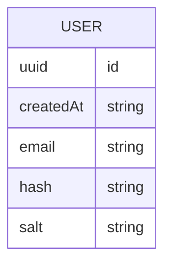

# api routes appolo server and client auth

[link](https://github.com/vercel/next.js/tree/canary/examples/api-routes-apollo-server-and-client-auth)

# others

setting up

https://www.apollographql.com/docs/apollo-server/getting-started

